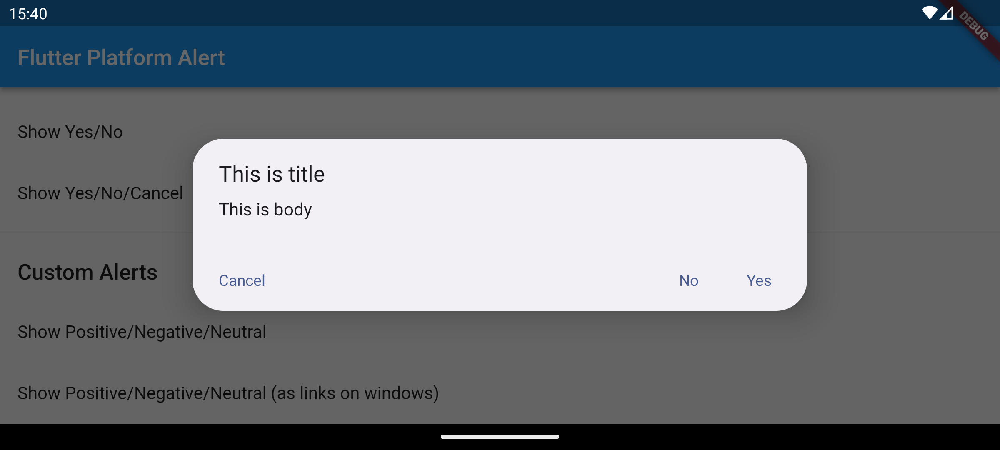
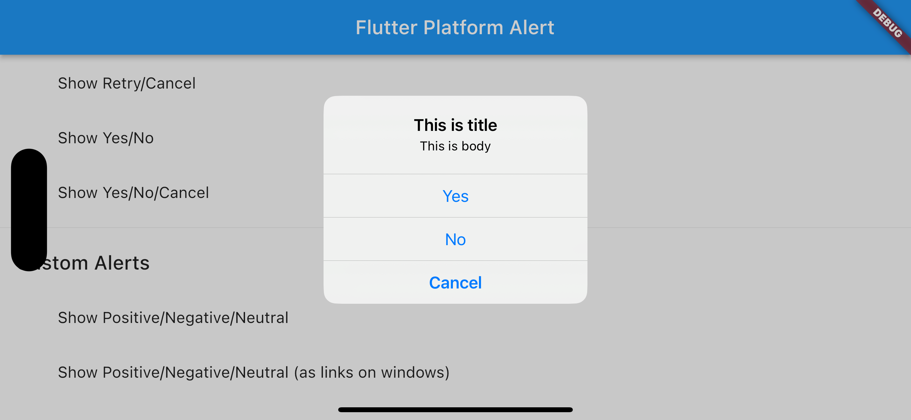
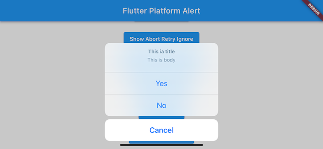
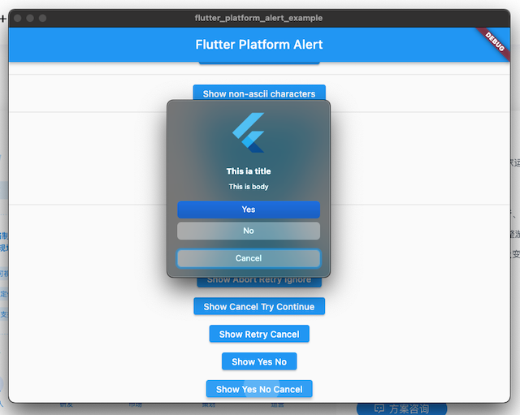
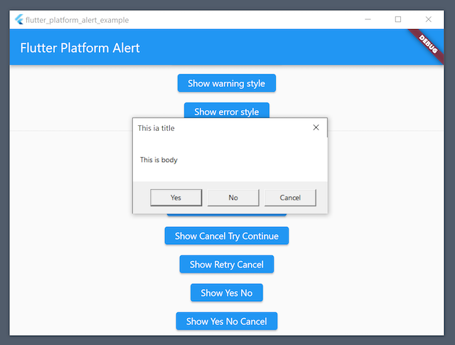
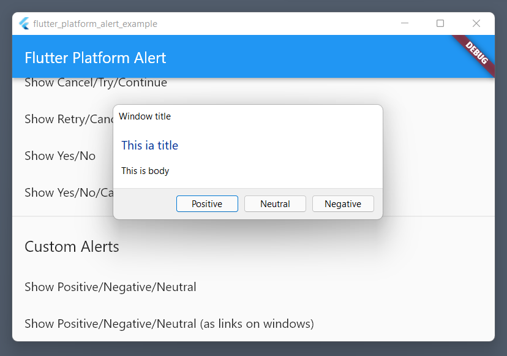
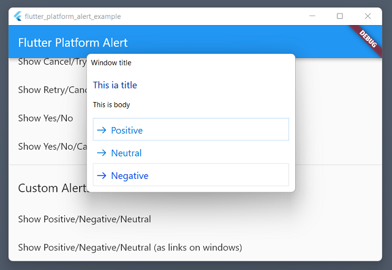
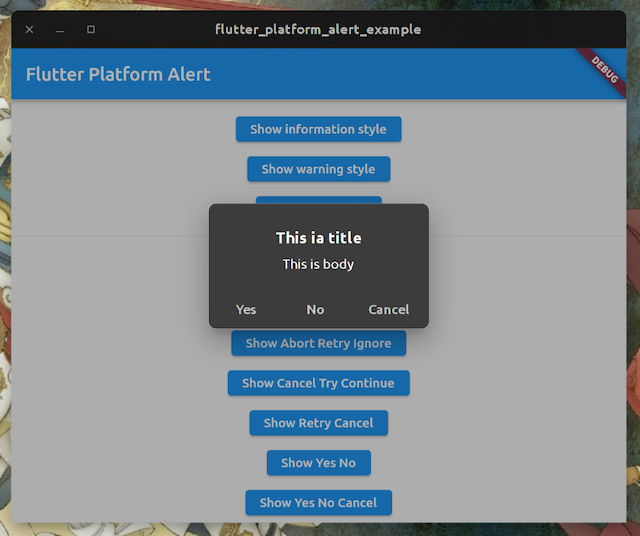

# flutter_platform_alert

2021 and onwards © Weizhong Yang a.k.a zonble.

[](https://pub.dartlang.org/packages/flutter_platform_alert) [](https://github.com/zonble/flutter_platform_alert/actions) [](https://github.com/zonble/flutter_platform_alert/blob/main/LICENSE)

A simple plugin to present native alerts, including playing alert sounds and
showing alert dialogs on various platforms including iOS, Android, Windows,
macOS and Linux.


It uses following API to show play alert sound.

- iOS: [AudioService](https://developer.apple.com/documentation/audiotoolbox/1405248-audioservicesplaysystemsound)
- Android: [RingtoneManager](https://developer.android.com/reference/android/media/RingtoneManager)
- macOS: [NSSound](https://developer.apple.com/documentation/appkit/nssound/2903487-beep)
- Windows: [MessageBeep](https://docs.microsoft.com/en-us/windows/win32/api/winuser/nf-winuser-messagebeep)
- Linux: [gtk_widget_error_bell](https://docs.gtk.org/gtk3/method.Widget.error_bell.html)

It uses following API to show alert dialogs.

- iOS: [UIAlertController](https://developer.apple.com/documentation/uikit/uialertcontroller) (It requires iOS 8)
- Android: [AlertDialog](https://developer.android.com/reference/android/app/AlertDialog)
- macOS: [NSAlert](https://developer.apple.com/documentation/appkit/nsalert)
- Windows: [MessageBox](https://docs.microsoft.com/en-us/windows/win32/api/winuser/nf-winuser-messagebox) and
  [TaskDialogIndirect](https://docs.microsoft.com/en-us/windows/win32/api/commctrl/nf-commctrl-taskdialogindirect)
- Linux: [GtkMessageDialog](https://docs.gtk.org/gtk3/class.MessageDialog.html)

The package was developed and tested on

- iOS 15
- Android 11
- macOS 11 Big Sur and mac OS 12 Monterey / Xcode 13
- Windows 10 / Visual Studio Community 2019
- Ubuntu 21.10

## Getting Started

- Add the dependency to your pubspec.yaml file by `flutter pub add flutter_platform_alert`.
- Run `flutter pub get`.

To play platform alert sound.

```dart
import 'package:flutter_platform_alert/flutter_platform_alert.dart';
await FlutterPlatformAlert.playAlertSound();
```

To show a platform alert dialog.

```dart
import 'package:flutter_platform_alert/flutter_platform_alert.dart';
await FlutterPlatformAlert.playAlertSound();

final clickedButton = await FlutterPlatformAlert.showAlert(
    windowTitle: 'This ia title',
    text: 'This is body',
    alertStyle: AlertButtonStyle.yesNoCancel,
    iconStyle: IconStyle.information,
);
```

To show an alert dialog with custom button titles:

```dart
import 'package:flutter_platform_alert/flutter_platform_alert.dart';
await FlutterPlatformAlert.playAlertSound();

final result = await FlutterPlatformAlert.showCustomAlert(
  windowTitle: 'This is title',
  text: 'This is body',
  positiveButtonTitle: "Positive",
  negativeButtonTitle: "Negative",
  neutralButtonTitle: "Neutral",
  options: PlatformAlertOptions(
    windows: WindowsAlertOptions(
      additionalWindowTitle: 'Window title',
      showAsLinks: true,
    ),
  ),
);
```

## Platform Alert Dialogs

### Alert Styles

When calling `showCustomAlert`, you can assign any button titles and use up to
three buttons. Once there is no button title specified, it falls back to only an
"OK" button.

When calling `showAlert`, you can specify the buttons listed in the alert dialog
by passing `alertStyle` argument. The package follows the API design on Windows
(see the reference of [MessageBox win32
API](https://docs.microsoft.com/en-us/windows/win32/api/winuser/nf-winuser-messagebox)),
and it provides following styles:

- Abort, retry and ignore
- Cancel, try again and continue
- OK
- OK and cancel
- Retry and cancel
- Yes and no
- Yes, no, and cancel

Since each platform has its own conventions, the order of these buttons are not
guaranteed to be the same.

### Icon Styles

The package also follow the API design of MessageBox on Windows to add icons to
the alert dialogs (see the link above). There are several different icons styles
but actually four:

- No icon
- Warning icon
- Information icon
- Question icon

Please note that these icons are not available on iOS and Android.

### Themes/Dark or Light Mode

On iOS and macOS, the alert dialogs follows the dark/light mode settings on
users' system. On Linux, the alert dialogs are rendered with current GTK theme.
On Windows, they are always in light mode even you choose to use dark mode on
Windows 10 and Windows 11.

On Android, the alert dialog uses the default theme of Material design
(as Theme.Material.Dialog.Alert).

## Localization

Since the plugin calls native API, if you want to localize buttons like "OK",
"Cancel" and so on on Platforms like iOS, macOS and Linux, you have to do some
works in your app.

- To localize the button titles on iOS and macOS, add "Localizable.strings" or
  "Localizable.stringsdict" files in your Xcode project. Visit Apple's official
  page for [localization](https://developer.apple.com/localization) for further
  information.
- On Linux, we use [gettext](https://www.gnu.org/software/gettext/) to localize
  apps. Please update the PO files in your projects once you integrate the
  plugin.

Android apps embeds resources for localized strings. The localized strings files
for the project are located under
[android/src/main/res](https://github.com/zonble/flutter_platform_alert/tree/main/android/src/main/res).
Once you need to add new languages, just fork the project and put your files
under the folder.

On Windows, the buttons on the message boxes will be in the Windows system
language.

## License

The package in released under MIT License.

## Screenshots

Android 13 on Pixel 6 emulator



iOS 16 in Simulator



iOS 15 in Simulator (IosAlertOptions: alertStyle = IosAlertStyle.actionSheet)



macOS 12 Monterey



Windows 10 with MessageBox API



Windows 11 with TaskDialogIndirect API



Windows 11 with TaskDialogIndirect API that shows buttons as links



Ubuntu 21.10

